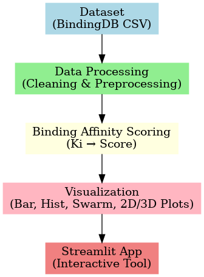

# 🔬 Drug-Target Binding Affinity Visualizer

This is a **Streamlit-based interactive application** for visualizing **drug–protein binding interactions** using real-world bioinformatics data from the **[BindingDB](https://www.bindingdb.org/)** database.  
It analyzes **binding affinity scores (Ki values)** and presents clear, interactive visualizations to help researchers explore **strong drug–target candidates**.

🌐 **Live App:** [Click here to try the Streamlit App](https://protein-drug-affinity-visualizer.streamlit.app/)

---

## 📊 Project Overview

- **Goal:** Analyze and visualize ligand–target interactions using Ki values  
- **Data Source:** [BindingDB](https://www.bindingdb.org/)  
- **Key Technologies:** Python, Pandas, NumPy, Streamlit, Matplotlib, Seaborn, Plotly  

---

## 🛠 Workflow



**Steps:**
1. **Dataset** – BindingDB CSV file containing target names, ligand SMILES, and Ki values  
2. **Data Processing** – Cleaning, preprocessing, and formatting  
3. **Binding Affinity Scoring** – Converting Ki values into custom interaction scores  
4. **Visualization** – Bar charts, histograms, swarm plots, and 2D/3D scatter plots  
5. **Streamlit App** – Upload your dataset and explore interactively  

---

## 🚀 Features

- 📥 Upload your own BindingDB CSV dataset for instant analysis  
- 📊 Visualize top ligands and their binding targets by interaction score  
- 🧠 Binding strength scoring system for quick interpretation  
- 📈 Multiple visualizations – bar charts, histograms, swarm plots, and 2D/3D scatter plots  
- 💾 Download sample CSV to test the app instantly  
- 🧬 Easy to extend for **machine learning–based drug discovery**  

---

## ⚗️ Binding Affinity Scoring System

| Ki (nM) Range     | Score | Interpretation       |
|------------------|--------|----------------------|
| Ki < 10          | 100    | Very Strong Binding  |
| 10 ≤ Ki < 100    | 70     | Strong Binding       |
| 100 ≤ Ki < 1000  | 40     | Moderate Binding     |
| Ki ≥ 1000        | 10     | Weak Binding         |

> **Note:** Lower Ki = Higher Binding Affinity  
> This scoring system helps identify **potent drug candidates** in drug discovery pipelines.

---

## 💡 How to Run Locally

1. **Clone the Repository**
   ```bash
   git clone https://github.com/ShubhamBioIT/Protein-Drug-affinity-visualizer.git
   cd Protein-Drug-affinity-visualizer
   
# install dependencies & Run App
   ```bash
   pip install -r requirements.txt
   streamlit run app.py


